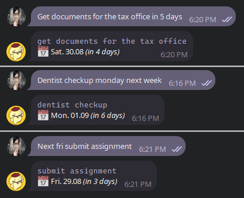

# Reminder Bot
> A simple but very usable reminder bot for Telegram that uses NLP to parse human readable reminder dates



The bot is designed to be used with [TickTick](https://ticktick.com/) reminders. But it will also send a list of upcoming daily tasks.

## Features
The bot is designed to be as simple as it gets.
You can send messages and include human readable or normal dates that would be converted to a reminder (also added to TickTick task list).
It supports all the basic relatives and absolute date formats, for example
- Tomorrow
- Next week/day/hour
- Next monday/tuesday/...
- In X weeks/days/hours/minutes
- And some combinations of those above, such as "Next week at 5"

## How to use

### Setup environment
Add the following environment variables to your environment (or .env file):
```yml
# For Ticktick / Dida365
DIDA365_CLIENT_ID=...
DIDA365_CLIENT_SECRET=...
PROJECT_ID=... # ID of the project the tasks should be added to

# For the Telegram Bot
BOT_TOKEN=...
USER_ID=... # Telegram user ID
```

You can find out how to get the TickTick CLIENT_ID and CLIENT_SECRET here:
https://pypi.org/project/dida365/

### Run the bot
You can host or run the bot by running:
```sh
pip install -r requirements.txt
streamlit run app.py
```